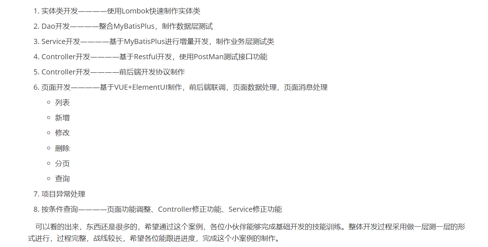

# springboot--提升效率，不去多想

## springboot基本介绍

springboot 是 spring 的一个子项目。

用springboot创建项目分为三部分，首先是添加依赖，其次，创建app的类，相当于软件的入口函数。最后编写启动类即可。这里我的理解是就跟qt给的那种框架是一样的。

## 配置

pom.yaml文件

pom.yaml中的parent内部自己定义坐标版本，其作用是帮你自动索引到最适合的包的版本号，使得我们后续写依赖的过程，可以自动分配版本号
pom.yaml中的starter相当于封装很多个依赖，集中整合，很多不用自己一个一个添加，其中的版本号在starter中全部定义好了

文件config配置
SpringBoot默认配置文件是application.properties，三种配置文件的优先级顺序application.properties  >  application.yml  >  application.yaml

yaml文件完成数据读取以及类的初始化，第一种方法，针对具体的value，第二种env直接调用整个类，输出。第三种方法，自己定义类，想拿什么拿什么

### 基于SpringBoot实现SSMP整合（数据库管理小案例）

整合junit技术：
整合mybatis技术：添加sql以及mybatis等依赖、设置yaml配置数据库、写具体的@mapper映射，之后利用接口进行调用

整个driud数据源：driud整合的数据库连接格式，头是有一个driud的字段的。

lombok用来简化实体类的开发：@getter@setter