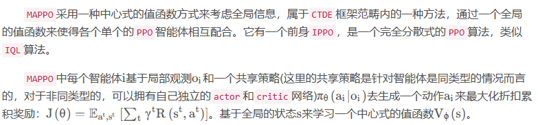

keywords:

the multi-agent advantage decomposition theorem--多智能体优势分解理论

ORDER MATTERS: AGENT-BY-AGENT POLICY OPTIMIZATION

IGM假设：

TRPO理论基础

应用 MARL 方法的优点在于它的去中心化；因此，采用集中培训和分散执行的方式:
VDN, QMIX, Q-DPP, QPLEX

关于CTDE范式

中心化训练去中心化执行（CTDE）是指在训练的时候使用一些单智能体看不到的全局信息以达到更好的训练效果，而在执行时不使用这些信息，每个智能体完全根据自己的策略直接动作以达到去中心化执行的效果。中心化训练去中心化执行算法能够在训练时有效地利用全局信息以达到去中心化执行效果，同时在进行策略模型推断时可以仅利用局部信息，使得算法具有一定的扩展性。CTDE可以类比成一个足球队的训练和比赛过程：在训练时，11个球员可以直接获得教练的指导从而完成球队的整体配合，而教练本身掌握着比赛全局信息，教练的指导也是从整支队伍、整场比赛的角度进行的；而训练好的11个球员在上场比赛时，则根据场上的实时情况直接做出决策，不再有教练的指导。

CTDE算法主要分为两种：一种是基于值函数的方法，例如VDN、QMIX等；另一种是基于Actor-Critic的方法，例如MADDPG和COMA等。
————————————————
版权声明：本文为CSDN博主「燕双嘤」的原创文章，遵循CC 4.0 BY-SA版权协议，转载请附上原文出处链接及本声明。
原文链接：https://blog.csdn.net/qq_42192693/article/details/124164161

关于MAPPO：

